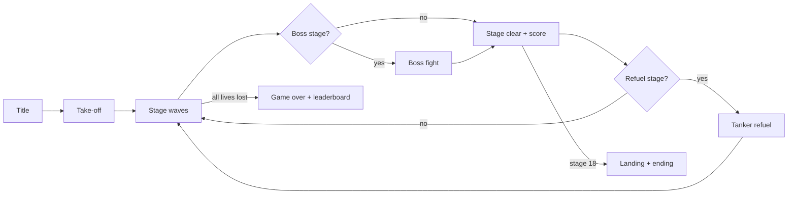
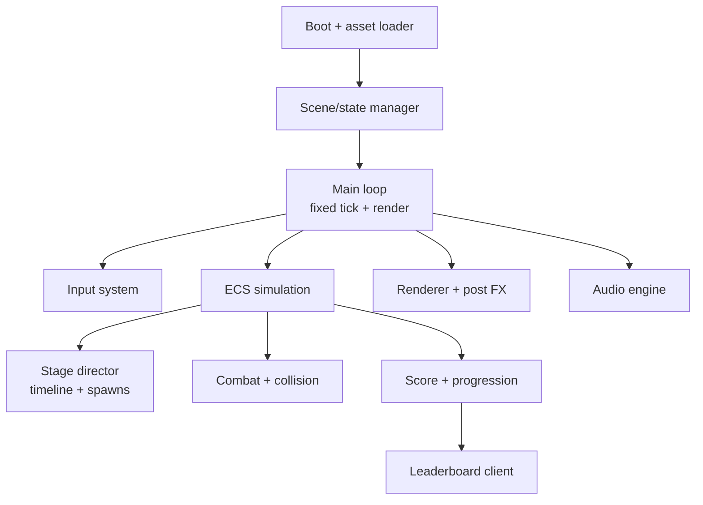

# Afterburner-Style Web Game — Full Project Outline

Sep 25, 2026 · @Ziv

## Overview & vision

A browser-based, arcade-speed jet combat shooter in the spirit of Sega's After Burner: third-person view behind the jet, fast forward scrolling, lock-on missiles, barrel rolls, and 18 short stages played in one sitting. The game ships as an original IP (own name, jet designs, music) — the "After Burner" name and Sega assets are references only.

**Design pillars**

- **Speed first** — the ground rushes by; the player always feels at full throttle.
- **Instant readability** — lock-on reticles, incoming-missile warnings and hits are obvious at a glance.
- **Arcade loop** — a full run takes 20–25 minutes; no tutorial wall, playable in 10 seconds.
- **Web-native** — loads in under 5 seconds, runs at 60 fps on a mid-range laptop and in mobile browsers.

**Scope (v1.0)**

| Area | In scope | Out of scope (post-launch) |
| --- | --- | --- |
| Modes | Arcade campaign, Score Attack, Practice (stage select) | Multiplayer, level editor |
| Content | 18 stages, 5 biomes, 4 bosses, 12 enemy types, 3 jets | Extra jets, seasonal stages |
| Platforms | Desktop Chrome/Firefox/Safari/Edge, iOS & Android browsers | Native app store builds |
| Input | Keyboard + mouse, gamepad, touch | Motion controls, HOTAS profiles |
| Online | Global leaderboard, anonymous accounts | Social login, friends lists |

**Success criteria**

- 60 fps on a 2021 mid-range laptop (integrated GPU) and on an iPhone 12-class device.
- First playable frame in ≤ 5 s on a 20 Mbps connection; initial download ≤ 15 MB.
- Average first session ≥ 8 minutes in playtests; ≥ 40% of testers reach stage 5.

## Game design

The player flies forward on rails at a variable speed, steers freely inside a screen-space box, and destroys waves with a cannon and lock-on missiles while dodging enemy fire through rolls and speed changes.

### Flight & control model

- **Rail + offset:** the camera follows a spline path; the jet moves within a ±X/±Y envelope around it, with bank angle driven by lateral velocity.
- **Throttle:** three states — cruise, afterburner (1.6× speed, enemy bullets fall behind), air-brake (0.6×, lets enemies overshoot).
- **Barrel roll:** full-deflection flick + hold triggers a 360° roll with 0.5 s of bullet immunity and a 2 s cooldown.
- **Loop (stage-specific):** scripted 360° pitch loop on marked set pieces to shake tailing enemies.
- **Assist:** optional aim-assist and auto-fire for touch and accessibility.

### Weapons

| Weapon | Behaviour | Ammo |
| --- | --- | --- |
| Vulcan cannon | Hitscan-ish tracer stream along the nose vector, 20 shots/s | Infinite |
| Homing missiles | Hold lock button, sweep reticle over up to 6 targets, release to fire a volley | 100 per stage, refilled at refuel |
| Flares (optional) | Break the lock of up to 3 incoming missiles | 3 per life |

### Enemies (12 types)

| Group | Types | Role |
| --- | --- | --- |
| Fighters | Head-on fighter, tail-chaser, swarm drone, ace (dodges) | Main pressure, missile threats |
| Heavy air | Bomber, gunship helicopter, AWACS (bonus target) | Tanky score targets |
| Ground | SAM site, AA gun, tank column | Fire upward, targetable by missiles only |
| Naval | Destroyer, missile boat | Sea stages |

Every enemy defines: spawn pattern, flight path (spline or behaviour), fire pattern, HP, score value, death FX.

### Stages & structure

- **18 stages** across 5 biomes: ocean, desert canyon, mountains, night city, stratosphere/space-edge finale.
- Stage length 60–90 s; waves scripted on a timeline, with random variants per run.
- **Refuel/rearm** after stages 5, 11 and 15: a short scripted docking sequence with a tanker (restores missiles, grants bonus).
- **Bosses** at stages 6, 12, 16 and 18 (e.g. flying fortress, carrier group, stealth ace, orbital platform), each with 2–3 phases and weak points.
- **Take-off and landing** cutscenes bracket the run.

### Scoring, lives & difficulty

- Score per kill × combo multiplier (kills within 1.5 s chain up to ×8); stage-clear bonus for hit rate and damage avoided.
- 3 lives, extra life at 1M and every 2M points; continues in Arcade mode reset score.
- Difficulty: Easy / Normal / Hard change enemy fire rate, bullet speed and missile lock time — not HP.
- Dynamic difficulty (optional): enemy fire rate eases after 2 deaths in one stage.

### Core game loop

Each stage loops back into the next until the run ends in a game over or the final landing.

## Technical architecture

Recommended stack: TypeScript + Three.js (WebGL2, WebGPU renderer as an opt-in path) + Vite, with a lightweight ECS and a fixed-timestep simulation decoupled from rendering. True 3D is chosen over sprite-scaling pseudo-3D because it gives modern visuals at little extra cost; a retro sprite-scaler look can still be done with billboards.

| Layer | Choice | Notes |
| --- | --- | --- |
| Language / build | TypeScript (strict), Vite, pnpm | ES modules, code-split per biome |
| Rendering | Three.js, custom shaders | Instanced meshes for bullets/enemies, GPU particles |
| Simulation | Custom ECS (e.g. bitECS or miniplex) | Fixed 60 Hz tick, interpolated render |
| Physics / collision | Custom: spheres + swept capsules, spatial hash | No full physics engine needed |
| Audio | Web Audio API (Howler.js optional) | Positional SFX, music stems, ducking |
| Input | Unified action map over Keyboard, Pointer Lock, Gamepad API, Touch | Rebindable, dead-zones |
| UI | HTML/CSS overlay for menus; in-canvas HUD | Menus accessible and localizable |
| Content | JSON/YAML stage timelines, glTF 2.0 models, KTX2 textures, Draco/meshopt | Hot-reload in dev |
| Persistence | localStorage/IndexedDB for settings and saves | Versioned schema |
| Backend | Serverless leaderboard (e.g. Cloudflare Workers + D1, or Supabase) | Score validation via replay/input hash |
| Hosting | Static CDN (Cloudflare Pages / Netlify / Vercel), PWA service worker | Offline play after first load |

### Runtime architecture

The stage director drives spawns from data; every gameplay system reads and writes ECS components only, which keeps systems testable headless.

### Key technical decisions

- **World scrolling:** the jet stays near origin and the world moves (floating origin) to avoid float precision issues on long stages.
- **Terrain:** tiled, streamed ground chunks per biome (heightmap or modular kit), recycled from a pool; fog hides the far edge.
- **Determinism:** seeded RNG + fixed tick so replays and anti-cheat score checks work.
- **Budgets:** ≤ 150 draw calls, ≤ 500k triangles on screen, ≤ 256 MB GPU memory, JS heap stable (no per-frame allocations in hot paths).
- **Quality tiers:** Low / Medium / High / Auto (resolution scale, shadows, post-FX, particle counts), auto-selected from a 3 s benchmark.

## Art & audio direction

Stylized low-poly 3D with saturated arcade colours, strong silhouettes and heavy speed cues (streaks, camera shake, FOV kick on afterburner); audio is driving 80s-style hard rock / synthwave with punchy, readable SFX.

### Visual asset list

| Category | Items | Count |
| --- | --- | --- |
| Player jets | 3 selectable jets, each with 3 LODs, afterburner FX, damage states | 3 |
| Enemies | Models per type (see Game design) + 2 LODs | 12 |
| Bosses | Multi-part models with destructible weak points | 4 |
| Support | Tanker plane, carrier (take-off/landing), wingman flyby | 3 |
| Environments | Terrain kits, skyboxes, props (rocks, buildings, ships, clouds) per biome | 5 biomes |
| VFX | Explosions (3 sizes), smoke trails, tracers, missile trails, flares, sparks, water splash, lens flare, heat haze | \~15 |
| HUD | Reticle, lock markers, radar/threat ring, score, lives, missile count, speed bar, "WARNING" alert, stage banners | 1 set |
| UI | Logo, title screen, menus, settings, leaderboard, pause, game over, credits | 1 set |
| Marketing | Key art, favicon/PWA icons, OG image, trailer capture | 1 set |

### Audio asset list

- **Music:** title theme, 5 biome tracks (loopable, 2–3 min), boss theme, refuel jingle, stage clear, game over, ending/credits — about 11 tracks.
- **SFX:** engine loop (pitch by throttle), afterburner, vulcan, missile launch/lock tone/impact, explosions (3), roll whoosh, hit on player, incoming-missile alarm, pickups/refuel, UI clicks — about 30 sounds.
- **Voice (optional):** short callouts ("Enemy approaching", "Missile lock", "Get ready") — about 15 lines.

### Style rules

- Enemy projectiles use one reserved warm colour; player shots use cool colours.
- Every lockable target gets the same lock-marker language.
- Colour-blind-safe palettes for HUD and warnings; never colour as the only cue.

## Milestones & roadmap

Seven milestones over roughly 29 weeks for a core team of 3 developers (one also covering QA) + 1 artist, with contracted music/SFX; durations are week offsets from kickoff and scale with team size.

| # | Milestone | Weeks | Exit criteria |
| --- | --- | --- | --- |
| M0 | Pre-production | 1–2 | GDD v1, tech spike proves 60 fps with 200 instanced objects, repo + CI live, art style frame approved |
| M1 | Core prototype | 3–6 | Greybox jet flies, shoots, locks and fires missiles at 1 enemy type on endless terrain; feels fun |
| M2 | Vertical slice | 7–10 | One polished biome, 3 stages incl. 1 boss, final-quality HUD, music, SFX, menus; runs on target mobile device |
| M3 | Alpha (feature complete) | 11–18 | All systems in: all enemy types, refuel, scoring, difficulty, settings, save, leaderboard, all input methods |
| M4 | Beta (content complete) | 19–25 | All 18 stages, 4 bosses, 5 biomes, full audio, localization; only bug-fixing and tuning remain |
| M5 | Release candidate | 26–28 | Zero P0/P1 bugs, perf budgets met on all target devices, accessibility and legal checks passed |
| M6 | Launch & live ops | 29+ | Public release, monitoring, first patch within 2 weeks |

Go/no-go review at the end of M1 (is the core feel fun?) and M2 (can the slice hit mobile budgets?) before committing to full content production.

## Task breakdown

Every task needed to ship v1.0, grouped into 11 workstreams. Estimates are in person-days (d) for one experienced developer or artist; "Dep" lists the task IDs that must land first; "M" is the milestone it belongs to.

### A. Project setup & tooling (≈ 16.5 d)

| ID | Task | Dep | Est | M |
| --- | --- | --- | --- | --- |
| A1 | Repo, TypeScript strict, ESLint/Prettier, Vite, folder conventions | — | 1 d | M0 |
| A2 | CI: lint, typecheck, unit tests, production build on every PR | A1 | 1 d | M0 |
| A3 | Preview deploy per PR + production deploy pipeline | A2 | 1 d | M0 |
| A4 | Vitest setup + headless simulation test harness | A1 | 1 d | M0 |
| A5 | Playwright smoke test: boot, play 10 s via scripted input, no console errors | A4, B1 | 2 d | M1 |
| A6 | Debug overlay: FPS, draw calls, entity counts, live tuning panel (lil-gui) | B3 | 2 d | M1 |
| A7 | Asset pipeline scripts: gltf-transform (meshopt/Draco), KTX2 textures, Opus/AAC audio | A1 | 3 d | M1 |
| A8 | Hot-reload of stage timelines and tuning JSON | F1 | 2 d | M2 |
| A9 | Game design doc v1 + technical design doc | — | 3 d | M0 |
| A10 | Task board, bug tracker, labels and triage routine | — | 0.5 d | M0 |

### B. Engine core (≈ 43 d)

| ID | Task | Dep | Est | M |
| --- | --- | --- | --- | --- |
| B1 | Main loop: fixed 60 Hz tick, accumulator, render interpolation, pause | A1 | 2 d | M0 |
| B2 | ECS integration, component/system conventions, entity pooling | B1 | 3 d | M0 |
| B3 | Renderer setup: scene, camera rig, resize/DPR, WebGL context-loss recovery | A1 | 2 d | M0 |
| B4 | Asset loader + manifest: glTF, KTX2, audio, progress bar, per-biome bundles | B3, A7 | 3 d | M1 |
| B5 | Scene/state manager: boot, title, game, pause, results | B1 | 2 d | M1 |
| B6 | Input system: action map, keyboard, mouse/pointer lock, gamepad, touch stick, rebinding | B1 | 5 d | M1 |
| B7 | Seeded RNG, deterministic tick, input recording and replay | B2, B6 | 3 d | M2 |
| B8 | Instanced rendering for bullets, enemies and props | B2, B3 | 3 d | M1 |
| B9 | GPU particle system (explosions, trails, smoke, sparks) | B8 | 5 d | M2 |
| B10 | Post-processing: bloom, speed lines/motion blur, colour grade, FXAA | B3 | 3 d | M2 |
| B11 | Floating origin + world scroller | B2 | 2 d | M1 |
| B12 | Collision: spatial hash, sphere/capsule sweeps, collision layers | B2 | 3 d | M1 |
| B13 | Event bus between systems (hits, kills, stage events) | B2 | 1 d | M0 |
| B14 | Camera system: chase follow, shake, FOV kick, cutscene splines | B3, C1 | 3 d | M1 |
| B15 | Quality tiers + 3 s auto-benchmark on first launch | B9, B10 | 3 d | M3 |

### C. Player jet & flight (≈ 20 d)

| ID | Task | Dep | Est | M |
| --- | --- | --- | --- | --- |
| C1 | Player entity: movement inside rail envelope, acceleration, bank/pitch visuals | B2, B3 | 3 d | M1 |
| C2 | Rail path follower: spline per stage, speed along path | B11 | 2 d | M1 |
| C3 | Throttle states: cruise, afterburner, air-brake + FX hooks | C1 | 2 d | M1 |
| C4 | Barrel roll: gesture detection, animation, 0.5 s immunity, cooldown | C1, B6 | 2 d | M1 |
| C5 | Scripted loop manoeuvre on set pieces | C2, B14 | 2 d | M3 |
| C6 | Player damage, death, respawn with invulnerability blink | D5 | 2 d | M1 |
| C7 | Jet selection: 3 jets with different speed, lock count, handling | C1, I1 | 2 d | M3 |
| C8 | Flight-feel tuning pass (all curves in data) | C1–C4 | 3 d | M2 |
| C9 | Aim assist + auto-fire options | D1, D2 | 2 d | M3 |

### D. Combat & weapons (≈ 23 d)

| ID | Task | Dep | Est | M |
| --- | --- | --- | --- | --- |
| D1 | Vulcan cannon: fire rate, tracers, hit detection, muzzle flash | C1, B12 | 2 d | M1 |
| D2 | Lock-on: reticle sweep, up to 6 targets, lock tone, lock markers | D1 | 4 d | M1 |
| D3 | Homing missiles: proportional-navigation guidance, trails, volley, ammo | D2 | 3 d | M1 |
| D4 | Enemy projectiles: bullets, homing missiles, flak (pooled) | B8 | 3 d | M1 |
| D5 | Damage model: HP, hit reactions, hit-stop, damage flash | B12 | 2 d | M1 |
| D6 | Incoming-missile warning + threat direction indicators | D4, G3 | 2 d | M2 |
| D7 | Flares / countermeasures | D4 | 2 d | M3 |
| D8 | Kill explosions, debris, score pop-ups | B9, D5 | 2 d | M2 |
| D9 | Combo / score multiplier | D5 | 2 d | M2 |
| D10 | Ground targets missile-only; lock filtering by layer | D2 | 1 d | M3 |

### E. Enemies & AI (≈ 30 d)

| ID | Task | Dep | Est | M |
| --- | --- | --- | --- | --- |
| E1 | Enemy framework: data-driven definitions (HP, model, score, patterns) | B2 | 3 d | M1 |
| E2 | Movement behaviours: spline, pursuit, flyby, strafe, formation, evade | E1 | 5 d | M1 |
| E3 | Fire patterns: aimed, spread, burst, homing, leading shots | D4, E1 | 3 d | M2 |
| E4 | 4 fighter types (head-on, tail-chaser, swarm drone, ace) | E2, E3 | 4 d | M2 |
| E5 | 3 heavy air types (bomber, gunship, AWACS) | E2, E3 | 3 d | M3 |
| E6 | 3 ground types (SAM site, AA gun, tank column) | F3 | 3 d | M3 |
| E7 | 2 naval types (destroyer, missile boat) | F3 | 2 d | M3 |
| E8 | Spawn system + wave composer (formations, entries from front/sides/behind) | E1, F1 | 3 d | M1 |
| E9 | Off-screen and behind-you indicators for tail-chasers | E2, G3 | 1 d | M2 |
| E10 | Per-difficulty enemy tuning pass | E4–E7 | 3 d | M4 |

### F. Stages, terrain & bosses (≈ 63 d)

| ID | Task | Dep | Est | M |
| --- | --- | --- | --- | --- |
| F1 | Stage data format + stage director (spawns, speed changes, music cues, banners on a timeline) | E1 | 4 d | M1 |
| F2 | Debug timeline scrubber: jump to any second of a stage | F1, A6 | 3 d | M2 |
| F3 | Terrain streaming: chunk pool, biome kits, heightmaps, ground collision | B11 | 5 d | M1 |
| F4 | Sky, fog and lighting presets per biome (day, dusk, night, stratosphere) | B3 | 3 d | M2 |
| F5 | Water rendering for ocean stages | F3 | 3 d | M2 |
| F6 | Fly-through cloud layers | B8 | 2 d | M3 |
| F7 | Design and script stages 1–6 (ocean, desert) | F1, E4 | 6 d | M3 |
| F8 | Design and script stages 7–12 (mountains, night city) | F7 | 6 d | M4 |
| F9 | Design and script stages 13–18 (city, stratosphere finale) | F8 | 6 d | M4 |
| F10 | Boss framework: multi-part entity, weak points, phases, boss health bar | E1, D5 | 4 d | M2 |
| F11 | Boss 1 — flying fortress | F10 | 3 d | M2 |
| F12 | Boss 2 — carrier group | F10 | 3 d | M3 |
| F13 | Boss 3 — stealth ace | F10 | 3 d | M4 |
| F14 | Boss 4 — orbital platform (finale) | F10 | 4 d | M4 |
| F15 | Refuel/rearm sequence with tanker | B14, C2 | 3 d | M3 |
| F16 | Take-off, landing and ending cutscenes | B14 | 3 d | M4 |
| F17 | Randomised wave variants per run (seeded) | F1, B7 | 2 d | M3 |

### G. Game flow, UI & HUD (≈ 28.5 d)

| ID | Task | Dep | Est | M |
| --- | --- | --- | --- | --- |
| G1 | UI framework: HTML overlay, screen stack, gamepad/keyboard focus navigation | B5 | 3 d | M1 |
| G2 | Title screen + attract mode driven by recorded replays | G1, B7 | 2 d | M3 |
| G3 | HUD: reticle, lock markers, score, lives, missiles, speed, stage | D2 | 4 d | M2 |
| G4 | Radar / threat ring | G3 | 2 d | M3 |
| G5 | Stage intro/clear banners, results screen with bonus tally | G3, D9 | 2 d | M2 |
| G6 | Pause menu | G1 | 1 d | M1 |
| G7 | Settings: graphics, audio, controls + rebinding, accessibility | G1, B6, B15 | 4 d | M3 |
| G8 | Game over, continue, high-score name entry | G1, J2 | 2 d | M3 |
| G9 | Mode select: Arcade, Score Attack, Practice (stage select) | G1 | 2 d | M3 |
| G10 | Leaderboard screen (global, weekly, per mode) | J3 | 2 d | M3 |
| G11 | Loading screen + first-run control tips | B4 | 1 d | M2 |
| G12 | Credits screen | — | 0.5 d | M4 |
| G13 | Touch layout: virtual stick, fire/lock/roll buttons, responsive HUD safe areas | B6, G3 | 3 d | M2 |

### H. Audio (≈ 13 d in-house + ≈ 40 d contracted)

| ID | Task | Dep | Est | M |
| --- | --- | --- | --- | --- |
| H1 | Audio engine: Web Audio graph, music/SFX/voice buses, unlock on first gesture | B1 | 2 d | M1 |
| H2 | Engine loop with throttle-driven pitch and filter | H1, C3 | 1 d | M2 |
| H3 | Positional SFX for enemies, missiles, explosions; voice limiting | H1 | 2 d | M2 |
| H4 | Music system: loops, crossfades, boss stingers, ducking | H1 | 2 d | M2 |
| H5 | Audio brief, reference tracks, contract composer/sound designer | A9 | 1 d | M0 |
| H6 | Music production, about 11 tracks | H5 | 30 d (contract) | M2–M4 |
| H7 | SFX production, about 30 sounds | H5 | 10 d (contract) | M2–M3 |
| H8 | Voice callouts, about 15 lines (optional) | H5 | 3 d | M4 |
| H9 | Final mix and loudness pass (target −16 LUFS) | H6, H7 | 2 d | M4 |

### I. Art production (≈ 84 d)

Greybox placeholders unblock all code tasks; final art replaces them per milestone.

| ID | Task | Dep | Est | M |
| --- | --- | --- | --- | --- |
| I1 | Style frame, colour script per biome, art bible | A9 | 4 d | M0 |
| I2 | Player jets ×3: model, textures, 3 LODs, afterburner nozzle FX | I1 | 9 d | M1–M3 |
| I3 | Fighter models ×4 | I1 | 6 d | M2 |
| I4 | Heavy air models ×3 | I1 | 5 d | M3 |
| I5 | Ground ×3 + naval ×2 models | I1 | 6 d | M3 |
| I6 | Bosses ×4, multi-part with destructible weak points | F10 | 16 d | M2–M4 |
| I7 | Support models: tanker, carrier, wingman | I1 | 4 d | M3 |
| I8 | Terrain kits and props for 5 biomes | F3 | 15 d | M2–M4 |
| I9 | Skyboxes ×5 | F4 | 3 d | M2–M3 |
| I10 | VFX flipbooks and shaders, about 15 effects | B9 | 6 d | M2–M3 |
| I11 | HUD graphics and icons | G3 | 3 d | M2 |
| I12 | UI art: logo, title screen, menu skin | G1 | 4 d | M3 |
| I13 | Key art, PWA icons, social/OG image | I12 | 3 d | M5 |

### J. Backend, leaderboard & persistence (≈ 17 d)

| ID | Task | Dep | Est | M |
| --- | --- | --- | --- | --- |
| J1 | Save system: settings, unlocks, best scores; versioned schema migrations | B5 | 2 d | M3 |
| J2 | Anonymous player ID + display name | J3 | 1 d | M3 |
| J3 | Leaderboard API: submit, top N, around-me, weekly reset, rate limiting | — | 4 d | M3 |
| J4 | Score validation: server re-simulates the input log (or plausibility checks as fallback) | B7, J3 | 5 d | M4 |
| J5 | Name profanity filter | J2 | 0.5 d | M3 |
| J6 | Privacy-friendly analytics: stage reached, deaths, session length | J3 | 2 d | M3 |
| J7 | Error reporting with source maps | A3 | 1 d | M2 |
| J8 | Backend config as code, environments, backups | J3 | 1.5 d | M3 |

### K. Platform, performance, accessibility & localization (≈ 25 d)

| ID | Task | Dep | Est | M |
| --- | --- | --- | --- | --- |
| K1 | Browser compatibility matrix + feature detection (WebGL2, Gamepad, Fullscreen) | B3 | 2 d | M2 |
| K2 | Fullscreen, orientation handling, auto-pause on tab hide | B5 | 1 d | M2 |
| K3 | PWA: manifest, service worker, offline cache, update prompt | B4 | 2 d | M3 |
| K4 | Profiling passes on target devices: CPU, GPU, memory, GC (at M2, M4, M5) | — | 6 d | M2–M5 |
| K5 | Bundle optimisation: code splitting, lazy biome loading, compression | B4 | 2 d | M4 |
| K6 | Mobile thermals: 30/60 fps cap option, dynamic resolution | B15 | 2 d | M4 |
| K7 | Accessibility: colour-blind modes, shake/flash toggles, hold vs toggle, subtitles | G7 | 4 d | M3 |
| K8 | Localization: i18n strings, font coverage, EN + 4 languages incl. one RTL | G1 | 4 d | M4 |
| K9 | Legal: original naming/assets check, third-party licences, privacy policy | — | 2 d | M5 |

Total: about 363 person-days — roughly 279 d engineering, 84 d art — plus about 40 d of contracted audio, 35 d of QA and 14 d of release work (below) — about 412 in-house person-days overall.

## QA, performance budgets & testing

Quality is gated by hard performance budgets checked automatically in CI, a deterministic simulation that makes gameplay bugs reproducible, and five rounds of external playtests.

### Performance budgets

| Metric | Desktop target | Mobile target |
| --- | --- | --- |
| Frame time (p95) | ≤ 16.6 ms | ≤ 16.6 ms (≤ 33 ms on Low tier) |
| Draw calls | ≤ 150 | ≤ 100 |
| Triangles on screen | ≤ 500k | ≤ 200k |
| GPU memory | ≤ 256 MB | ≤ 150 MB |
| GC pauses during play | none > 4 ms | none > 4 ms |
| Initial download (to title screen) | ≤ 15 MB | ≤ 15 MB |
| Per-biome bundle | ≤ 8 MB | ≤ 8 MB |
| Time to first playable frame (20 Mbps) | ≤ 5 s | ≤ 7 s |

### Target device matrix

- **Desktop:** latest 2 versions of Chrome, Edge, Firefox, Safari on Windows and macOS; one integrated-GPU laptop as the floor.
- **Mobile:** iOS Safari on iPhone 12-class and newer; Android Chrome on a mid-range phone (e.g. Pixel 6a / Galaxy A5x class).
- **Input:** Xbox and PlayStation controllers via the Gamepad API, keyboard + mouse, touch.

### QA tasks (≈ 35 d)

| ID | Task | Dep | Est | M |
| --- | --- | --- | --- | --- |
| Q1 | Test plan, bug severity scale (P0–P3), triage cadence | A10 | 1 d | M1 |
| Q2 | Unit tests for collision, missile guidance, scoring, stage director | A4 | 6 d | M1–M4 |
| Q3 | Determinism test: same seed + input log gives identical score across browsers | B7 | 2 d | M2 |
| Q4 | Automated perf benchmark in CI: scripted fly-through, p95 frame time, fails on regression | A5 | 3 d | M2 |
| Q5 | Manual device-matrix passes | K1 | 8 d | M3–M5 |
| Q6 | 5 playtest rounds × 5 players: surveys, death heatmaps, drop-off points | M1 build | 6 d | M1–M4 |
| Q7 | Balance and difficulty tuning from playtest data and telemetry | Q6, J6 | 4 d | M4 |
| Q8 | Accessibility audit against the settings checklist | K7 | 1 d | M4 |
| Q9 | Full regression pass per release candidate | M4 | 3 d | M5 |
| Q10 | 60-minute soak test for memory leaks and audio drift | K4 | 1 d | M5 |

## Release & post-launch

The game launches as a static PWA on a CDN with a serverless leaderboard, first on web portals and a dedicated site, with a patch window two weeks after launch.

### Release tasks (≈ 14 d)

| ID | Task | Dep | Est | M |
| --- | --- | --- | --- | --- |
| R1 | Production hosting: CDN, custom domain, HTTPS, cache headers, immutable asset hashing | A3 | 1 d | M5 |
| R2 | Staged rollout: beta URL for testers, then production cut-over; rollback procedure | R1 | 1 d | M5 |
| R3 | Monitoring dashboards: errors, load times, leaderboard API health, alerts | J7 | 1.5 d | M5 |
| R4 | Landing page: trailer, screenshots, controls, credits, privacy policy | I13 | 2 d | M5 |
| R5 | Trailer capture and edit (60–90 s) | M4 | 3 d | M5 |
| R6 | Portal submissions (itch.io, Poki / CrazyGames or similar) with their SDK requirements | R1 | 2 d | M6 |
| R7 | Launch posts: dev log, Reddit/HN/social, press kit | R4, R5 | 1.5 d | M6 |
| R8 | Post-launch patch 1.0.1 from crash reports and feedback | R3 | 2 d | M6 |

### Post-launch backlog (not in v1.0 estimate)

- Weekly challenge stage with its own leaderboard (seeded variants).
- Additional jets and paint schemes as unlockables.
- Ghost replays of top scores.
- Co-op or versus multiplayer via WebRTC.
- Community stage editor using the existing stage data format.

## Risks & open questions

The biggest risks are mobile performance and whether the core flight feel is fun; both are tested before content production starts (M1 and M2 go/no-go).

| Risk | Impact | Mitigation |
| --- | --- | --- |
| Mobile GPUs miss 60 fps | Poor reviews, smaller audience | Budgets from M0, instancing everywhere, quality tiers, 30 fps fallback, test on the low-end device weekly |
| Core feel not fun at M1 | Wasted content work | Greybox prototype first; tune speed, roll and lock timing with playtests before M2 |
| Art scope (84 d) overruns | Slipped beta | Modular kits, shared enemy rigs, cut to 4 biomes / 15 stages if M3 is late |
| iOS Safari quirks (audio unlock, fullscreen, WebGL memory) | Crashes or silent game | Early device tests, audio unlock on first tap, texture memory caps |
| Leaderboard cheating | Untrustworthy scores | Deterministic replay validation (J4), rate limits, manual moderation tools |
| IP / trademark similarity to Sega's After Burner | Takedown | Original name, jets, music and UI; legal check (K9) before launch |
| Contracted audio late | Silent vertical slice | Licensed placeholder tracks; milestone-based contract payments |

### Open questions

- [x] Team size and start date — the 29-week plan assumes 3 developers + 1 artist; with 2 developers it stretches to about 36 weeks. **Decided: Ziv + Claude.**
- [x] Visual direction: modern stylised 3D, or retro sprite-scaling look with billboards? **Decided: both, as a switchable style.**
- [x] Terrain: procedural biome kits, or real-world terrain streamed through threetiles for recognisable locations? **Decided: procedural biome kits.**
- [x] Monetisation: free with no ads, portal ad revenue, or a paid premium build? **Decided: free, no ads.**
- [x] Game title and branding. **Decided: Hot Tail.**
- [x] Which 4 languages to localize beyond English? **Decided: English only.**
